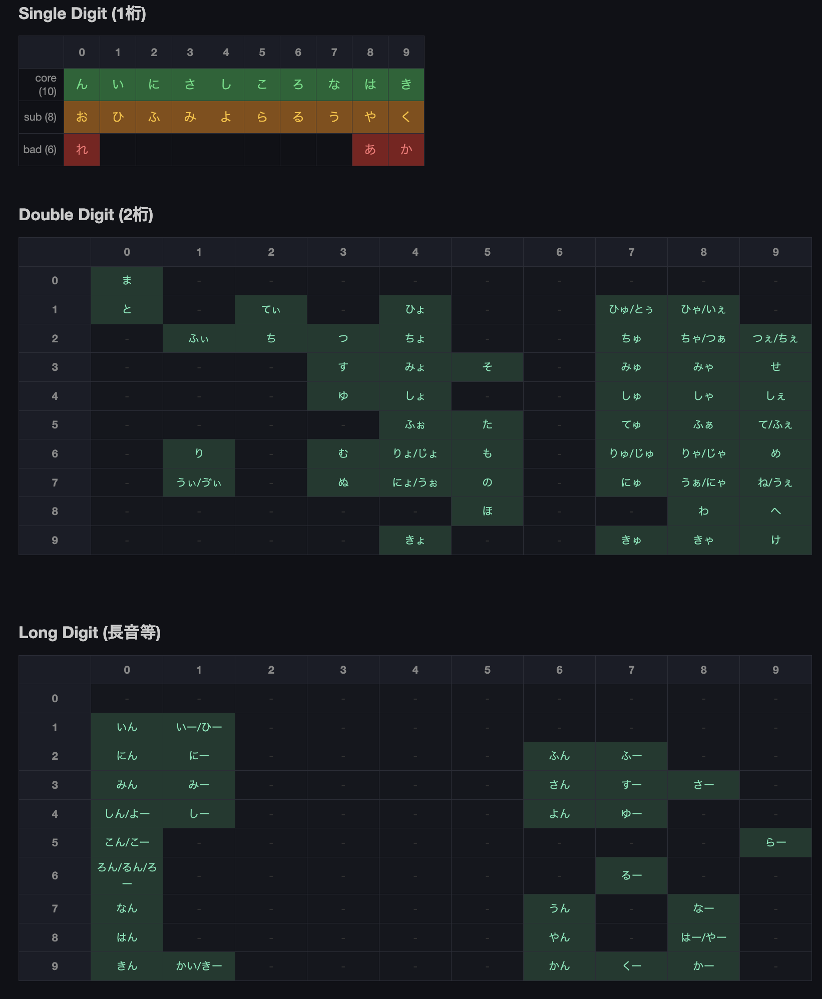
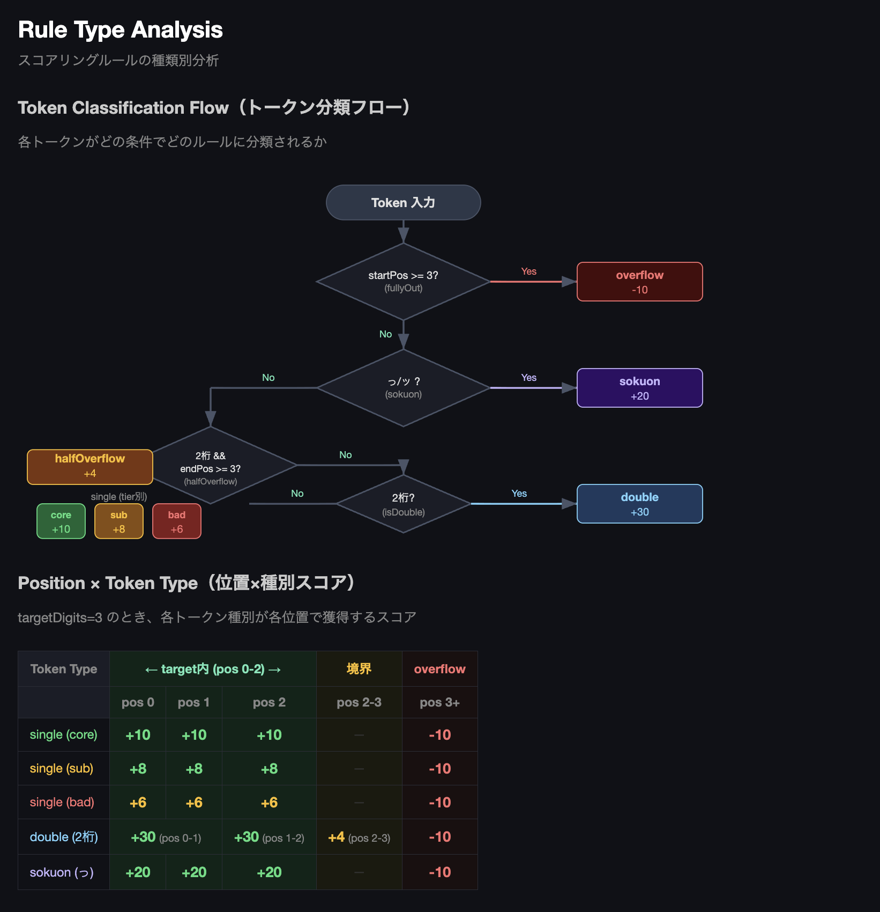
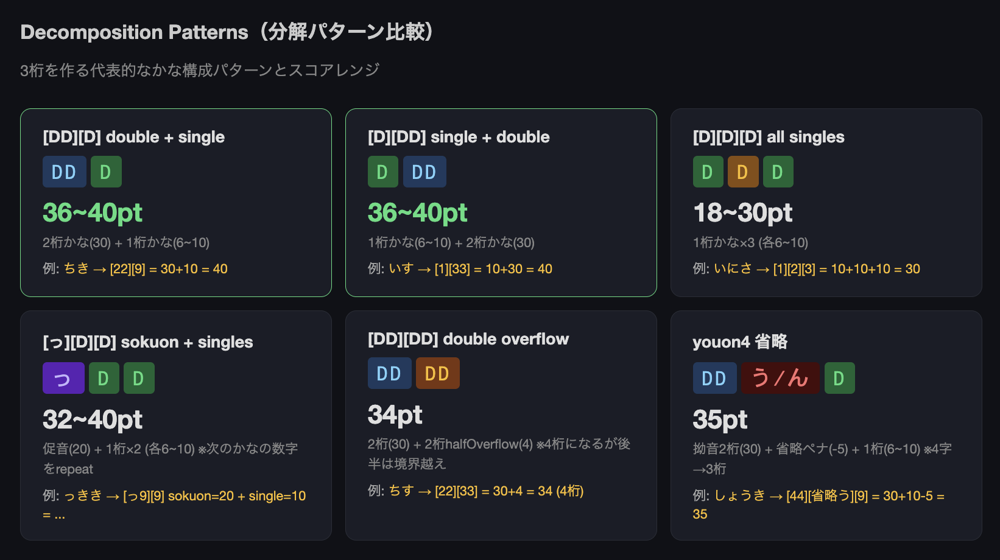

# 999

メモリースポーツ（数字記憶競技）のための、かな → 3桁数字 (000-999) 変換表作成支援ツール。

3桁の数字それぞれに覚えやすい日本語の単語を割り当て、数字列を物語として記憶する「ナンバーシステム」の構築を効率化します。Google Spreadsheet をデータベースとして使い、単語のエンコード品質スコアリング・完成度トラッキング・可視化を提供します。

## Scoring Rules

### Digit Mapping

Single / Double / Long の各テーブルとティア分類。



### Rule Type Analysis

Token Classification Flow と Position × Token Type マトリクス。



### Decomposition Patterns

3桁を作る代表的なかな構成パターンとスコアレンジ。



## Scripts

```bash
nr sync        # Google Sheet からデータ同期
nr score       # 単語スコアリング
nr check:kana  # かなカバレッジチェック
nr check:digits # 桁数チェック
nr check:errors # エラーチェック
nr viz         # 単語ダッシュボード可視化HTML生成
nr test        # テスト実行
```

## Docs

- [かな数字対応表](docs/kana-number-table.md) - 対応表・桁数判定ルール・スコア計算
