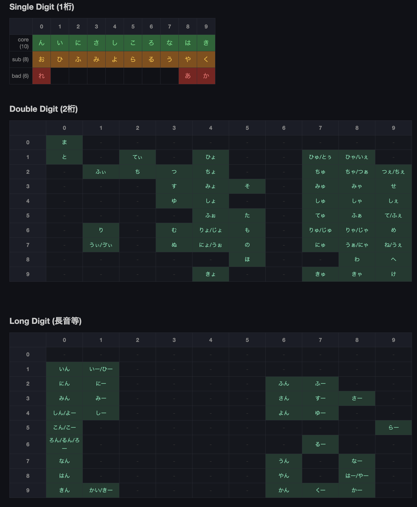
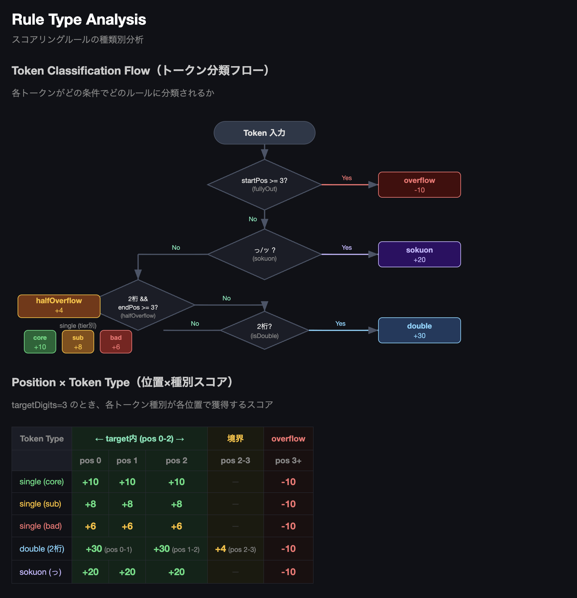
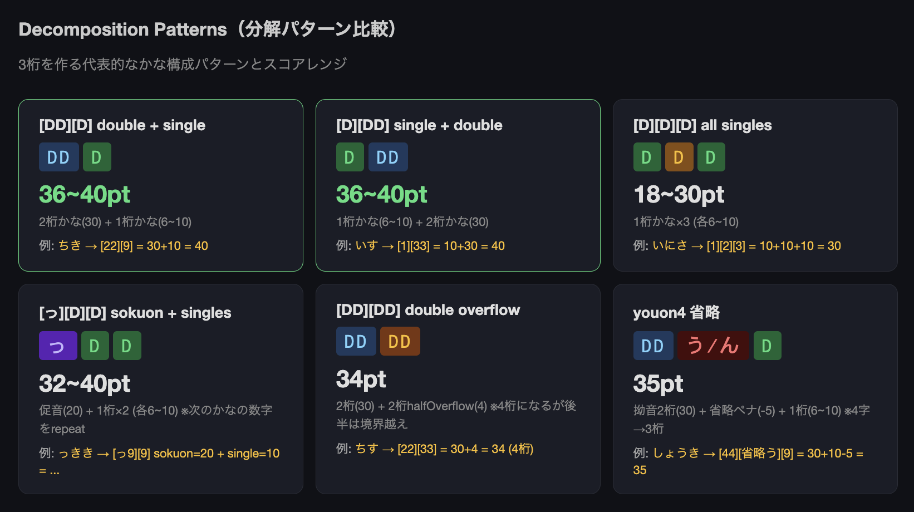

# 999

メモリースポーツ（数字記憶競技）のための、かな → 3 桁数字 (000-999) 変換表作成支援ツール。

3 桁の数字それぞれに覚えやすい日本語の単語を割り当て、数字列を物語として記憶する「ナンバーシステム」の構築を効率化します。Google Spreadsheet をデータベースとして使い、単語のエンコード品質スコアリング・完成度トラッキング・可視化を提供します。

## Scoring Rules

### Digit Mapping

Single / Double / Long の各テーブルとティア分類。



### Rule Type Analysis

Token Classification Flow と Position × Token Type マトリクス。



### Decomposition Patterns

3 桁を作る代表的なかな構成パターンとスコアレンジ。



## Scripts

```bash
nr sync:all    # ★これ1本でOK: シート取得 → rankey書戻し → 歌詞/配信データ再生成
nr sync        # Google Sheet からデータ同期
nr push        # src/data/words.tsv を Google Sheet に書き戻す
nr push:tags   # BCD列の #tag 一覧を tags シートへ書き出す
nr score       # 単語スコアリング
nr stats:goro  # ゴロ割り当て分布統計 (docs/goro-stats.md) を生成
nr check:kana  # かなカバレッジチェック
nr check:digits # 桁数チェック
nr check:errors # エラーチェック
nr viz         # 単語ダッシュボード可視化HTML生成
nr lyrics      # 代表語/FF の歌詞テキスト (lyrics/) を再生成
nr sheet:audit # シート監査 (dry-run。書込プランを sheet-audit.out.json に出す)
nr sheet:rankey # 各スロットの rankey 列をシートへ書き戻す
nr test        # テスト実行
```

### 同期は `nr sync:all` 1 本

シートを直接編集したあと、ローカルと配信データを追従させるにはこれだけ実行します。

```
nr sync:all
  ├ sync         シート(999)  → src/data/words.tsv
  ├ sync:tags    シート(tags) → src/data/tags.json
  ├ sync:card    シート(card) → src/data/cards.tsv
  ├ sheet:rankey rankey を再計算してシートへ書き戻す
  ├ lyrics       lyrics/ を再生成
  └ build:data   visualize-words.data.json と private/data.json を再生成
```

本番へ出すのは別で `nr deploy`。

> ⚠️ **`nr push` は `sync:all` に含めません。** `push` は 999 タブを clear → 全上書き
> するため、`words.tsv` に無い列（`check` / `rankey` / スロット 4 以降 / 手動列）が
> 消えます。ローカルからシートへ戻す必要があるときだけ、消える列を承知の上で使ってください。

## Google Sheet Read/Write

読み取りは公開シートなら `nr sync` で動きます。

書き込みは Google Sheets API を使います。認証は次のどちらかです。

1. 推奨: `gcloud auth application-default login`
2. または Google Cloud で service account を作成し、JSON を `.config/google-service-account.json` に置く
3. service account を使う場合は `client_email` を対象スプレッドシートの編集者に追加する
4. `nr push` を実行する

必要に応じて `SHEET_URL` で対象シート URL を上書きできます。URL には `gid` を含めてください。認証ファイルは `GOOGLE_APPLICATION_CREDENTIALS` / `GOOGLE_SERVICE_ACCOUNT_PATH` / `GOOGLE_SERVICE_ACCOUNT_JSON` でも指定できます。

タグ一覧を別シートに出したい場合は `nr push:tags` を使います。`tags` シートがなければ自動作成し、`hito / mono / gainen` の各セルに含まれる `#tag` を集計して書き込みます。

列構成は `tag / title / count / hito / mono / gainen / nums / labels` です。B 列の `title` は複数人が手で編集する列のため、書き込み前に既存シートの `tag → title` を読み取って引き継ぎます（新規 tag は空欄、上書きしない）。

## Docs

- [かな数字対応表](docs/kana-number-table.md) - 対応表・桁数判定ルール・想起ツリー・スコア計算
- [1 番号に対する操作の一覧](docs/num-actions.md) - 何ができて何ができないか、どの面から操作するか
- [ゴロ割り当て分布統計](docs/goro-stats.md) - `_YZ` / `XY_` / `X_Z` の 2 桁ゴロ分布（`nr stats:goro` で再生成）
