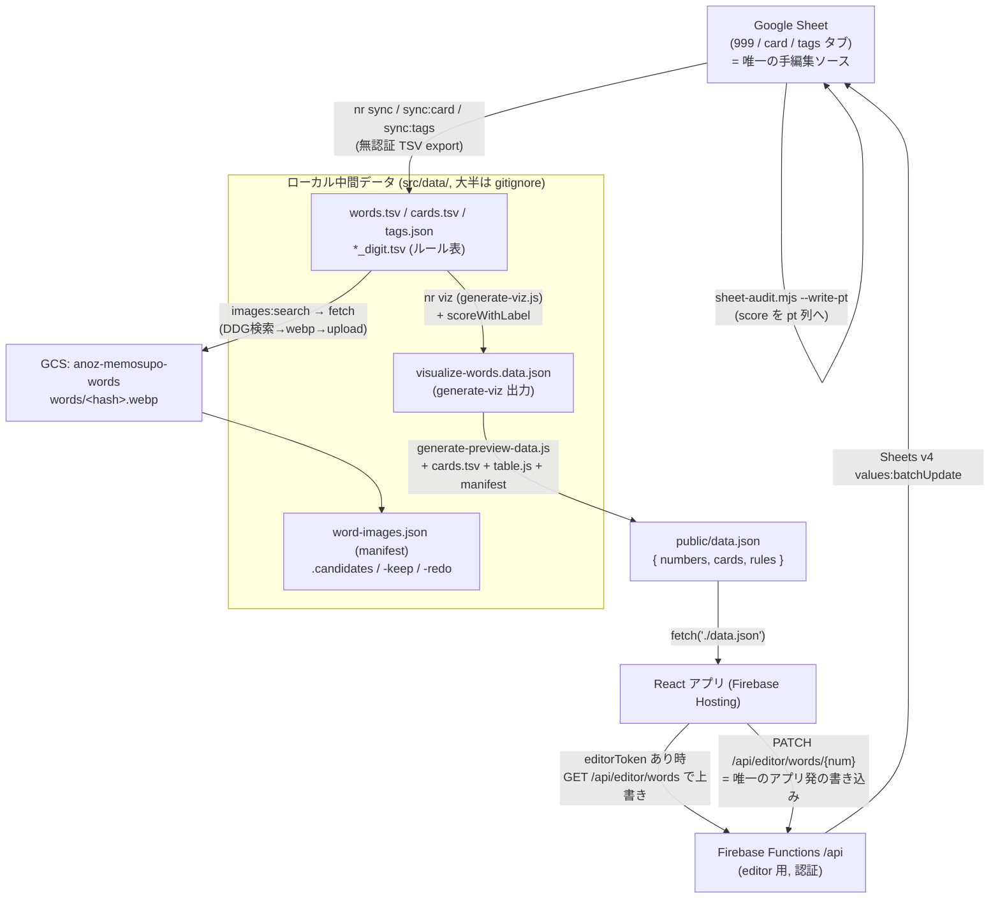

# データフロー全体像

999 数字暗記アプリの、Google Sheet からアプリ表示までの全データの流れをまとめる。
「シートの各フィールド」「中間データ」「画像」「編集機能」を横断して記述する。

- Spreadsheet ID: `1F2G4-6lqUPeYzHkpbhUtYKgDzrjNuUo8tbjXKyrzFHM`（全スクリプト共通ハードコード）
- Firebase project: `anoz-memosupo`（`.firebaserc`）／ Functions region: `asia-northeast1`
- GCS バケット（画像）: `anoz-memosupo-words`

---

## 0. 全体マップ



**要点:** ソースは Google Sheet ただ 1 つ。ローカルの `words.tsv` 以下、`data.json`、GCS 画像、シートの `pt`/`check` 列はすべて **そこから一方向に生成される派生キャッシュ**。アプリからシートへ戻る唯一の経路は EditorTab → Functions API のみ。

---

## 1. Google Sheet（source of truth）

### タブ一覧

| タブ / gid                  | 主な列                                                                                                         | 用途                                                 |
| --------------------------- | -------------------------------------------------------------------------------------------------------------- | ---------------------------------------------------- |
| **999** (gid `0`)           | `num`, `hito`, `mono`, 各スロット `wh1/wh1k/wh1Img … wh3`・`wm1 … wm3`、各 `k` 列の**左隣 `check`・右隣 `pt`** | 語呂本体。人(wh)/物(wm) × 語(word)/かな(k)/画像(Img) |
| **card** (gid `1530780723`) | `mark`, `person`, `action_p`, `score_p`, `object`, `action_o`, `score_o`, `action`, `score_a`                  | トランプ PAO。`score_*` は 0〜3                      |
| **tags** (gid 参照は title) | `tag`, `title`, `count`, `hito`, `mono`, `gainen`, `nums`, `labels`                                            | `#tag` 集計。`title` 列だけ手動メンテ                |

### 999 タブの列の意味

| 列                  | 意味                                                                                                                  | 誰が書くか                             |
| ------------------- | --------------------------------------------------------------------------------------------------------------------- | -------------------------------------- |
| `num`               | 3 桁数字（`/^\d{3}$/`）。データ行判定キー                                                                             | 人手                                   |
| `hito`              | 人物の語（`#tag` 記法可）                                                                                             | 人手 / EditorTab                       |
| `mono`              | 物・概念の語。**`gainen`(概念) は独立列を持たず `mono` に `#g` タグ付きで集約**される                                 | 人手 / EditorTab                       |
| `whN` / `wmN`       | スロットの暗記語（word 本体）。N=1..3（シート）、Editor は 1..5                                                       | 人手 / EditorTab                       |
| `whNk` / `wmNk`     | その語のかな読み。**エンコード・スコアの入力**                                                                        | 人手 / EditorTab                       |
| `whNImg` / `wmNImg` | 画像 URL                                                                                                              | 画像パイプライン経由（後述）           |
| `check`             | 監査フラグ（`[x]` 等）。各 `k` 列の**左隣**                                                                           | `sheet-audit.mjs` / `sheet-remark.mjs` |
| `pt`                | スコア（`scoreWithLabel`。**1/10 スケール** → [scoring-rules-blog.md](./scoring-rules-blog.md)）。各 `k` 列の**右隣** | `sheet-audit.mjs --write-pt`           |

> スロット列は `sheet-audit.mjs` が正規表現 `^(w[hm]\d)k$` で動的検出し、その左=`check`・右=`pt` を前提にする。**ヘッダ名やスロットの並びを変えると audit が例外で止まる**。

---

## 2. スロット名の 3 層（重要・混乱しやすい）

同じ「候補枠」が層によって別名で呼ばれる。

| 層                 | 名前                           | 枠数 | 備考                                                         |
| ------------------ | ------------------------------ | ---- | ------------------------------------------------------------ |
| Legacy             | `w1`, `w2`, `w1_2`, `w2_2`     | 4    | 旧スキーマ。**画像 manifest / GCS はこの名前でしか持たない** |
| シート/TSV（現行） | `wh1..wh3`(人), `wm1..wm3`(物) | 6    | `words.tsv` の実列                                           |
| Editor UI          | `wh1..wh5`, `wm1..wm5`         | 10   | 編集可能枠                                                   |

アプリ表示層のブリッジ（`app/data/parse.ts`, `app/lib/choice.ts`）:
`wh1←w1, wh2←w1_2, wm1←w2, wm2←w2_2`（wh3/wm3 は legacy 無し）。
→ **実体の画像 URL は常に legacy 4 枠で流れ、wh/wm はエイリアス**。wh3/wm3 の 3 候補目画像は現状 manifest に載らず未表示。

---

## 3. 同期スクリプト（シート → ローカル / ローカル → シート）

読み取りは 2 系統: **無認証 export**（公開シート前提の `export?format=tsv` / `gviz csv`）と **認証 values API**（`src/google-sheets.js` 経由、ADC / service account / `GOOGLE_OAUTH_ACCESS_TOKEN`）。書き込み系は全て後者。

| スクリプト           | 読む                          | 書く                                                           | 変換                                           | npm           |
| -------------------- | ----------------------------- | -------------------------------------------------------------- | ---------------------------------------------- | ------------- |
| `sync-sheet.js`      | 999/gid0（無認証 TSV）        | `src/data/words.tsv`                                           | 別名ヘッダ吸収、`splitConceptFields`、num 検証 | `sync`        |
| `push-sheet.js`      | `words.tsv`                   | 999/gid0（**clear→ 全上書き**）                                | 行列化して `overwriteSheetValues`              | `push`        |
| `sync-tags.js`       | tags（無認証 CSV）            | `src/data/tags.json`                                           | `tag→title` マップ                             | `sync:tags`   |
| `push-tags-sheet.js` | `words.tsv` + tags 既存 title | tags（全上書き）                                               | `#tag` 集計、title 引き継ぎ                    | `push:tags`   |
| `sync-card-sheet.js` | card/gid（無認証 TSV）        | `src/data/cards.tsv`                                           | `score_*` を 0〜3 正規化                       | `sync:card`   |
| `sheet-audit.mjs`    | 999/gid0（認証）              | 既定 dry-run→`sheet-audit.out.json`／`--write-pt` で **pt 列** | かな採点＋`missing/digit/read/sokuon3` 判定    | （直接 node） |
| `sheet-remark.mjs`   | `sheet-audit.out.json`        | 既定 dry-run／`--write` で **かな(k)セル末尾にマーカー**       | audit 結果を再鑑定・長音救済                   | （直接 node） |
| `score-words.js`     | `words.tsv` のみ              | 標準出力のみ                                                   | 完成度・スコア集計表示                         | `score`       |

### ⚠️ 運用上の gotcha

- **`push` は 999 タブを clear→ 全上書き**し、書くのは `words.tsv` の 21 列のみ。→ **`sync`→`push` の往復でシート上の `check` / `pt` / スロット 4 以降 / その他手動列が消える**（sync 時点で読み込んでいないため復元不可）。**pt を書いた後に `push` を流すと pt が飛ぶ**ので注意。
- `gainen` はシート上「mono 列 + `#g` タグ」に正規化されており、独立列としては保存されない。読み出し時に `splitConceptFields` で復元。
- `sheet-remark.mjs` は単独では動かない（`sheet-audit.mjs` が出す `sheet-audit.out.json` が入力）。実行順依存。両者とも npm script 未登録。
- 書き込みはデフォルト dry-run（`--write-pt` / `--write` 必須）。安全側だが忘れると無反映。
- `score` はシート非接触の純ローカル集計（同期フローの外）。

---

## 4. 中間データファイル（`src/data/`。★=source of truth、他は派生）

| パス                                                       | 主要フィールド                                                  | 生成元                  | 消費者                                             | 種別                |
| ---------------------------------------------------------- | --------------------------------------------------------------- | ----------------------- | -------------------------------------------------- | ------------------- |
| `words.tsv`                                                | num, hito, mono, wh1-3/wm1-3 × 語/よみ/画像                     | `sync-sheet.js`         | `words.js#loadWords` → 各生成、`app/data/parse.ts` | ★ 語彙              |
| `cards.tsv`                                                | mark, person, action*\*, score*\*, object                       | `sync-card-sheet.js`    | generate-preview-data, parse.ts                    | ★ カード            |
| `single_digit.tsv` / `double_digit.tsv` / `long_digit.tsv` | 数字 → かな割当表                                               | 手書き                  | `src/table.js`                                     | ★ ルール表          |
| `tags.json`                                                | 略語 → 正式名（`pr→プリコネ` 等）                               | `sync:tags`/`push:tags` | 画像検索クエリ生成, UI                             | ★ 辞書              |
| `word-images.json`（manifest）                             | num→slot ごと `{url,hash,sourcePage,sourceImageUrl,uploadedAt}` | `fetch-word-images.js`  | generate-preview-data が `*Img` に merge           | ★ **最終画像 SoT**  |
| `word-images.candidates.json`                              | 画像候補 URL/query/status                                       | `search-word-images.js` | fetch の入力                                       | 中間                |
| `word-images-keep.json`                                    | ロック集合 `"num:slot": true`                                   | `keep-all.js` / console | search/fetch の上書き保護                          | 制御 state          |
| `word-images-redo.json`                                    | やり直しフラグ                                                  | console / CLI           | fetch `--redo-only`                                | 制御 state          |
| `visualize-words.data.json`                                | `{ data:[row…], ruleStats }`                                    | **`generate-viz.js`**   | generate-preview-data, stats HTML                  | 生成物（gitignore） |
| `visualize-words.data.sample.json`                         | 同構造（sample 由来）                                           | generate-viz            | 公開デモ                                           | 生成物（commit 済） |
| `words.json`                                               | num, w1, w1k, w2, w2k                                           | 旧エクスポート          | **未使用（レガシー・未追跡）**                     | 旧派生物            |

> `words.json` は git 未追跡・現行チェーン未使用・旧スキーマの残骸。source of truth は `words.tsv`。

---

## 5. ビルドチェーン（中間データ → 配信用 data.json）

```
build
├─ build:data
│   ├─ node src/generate-viz.js           # words.tsv(+sample) → visualize-words.data(.sample).json
│   └─ node src/generate-preview-data.js  # viz.data.json + cards.tsv + table.js + word-images.json → public/data.json
└─ vite build                             # app/ を public/data.json 前提でバンドル

build:preview = generate-preview-data.js + (stats.html 等を public/ へ cp)
viz           = generate-viz.js 単体
deploy        = build:preview → build → firebase deploy --only hosting
deploy:api    = build:preview → build → firebase deploy --only functions:api,hosting
```

### generate-viz.js（score の計算地点）

- 入力: `words.tsv`（+ sample）を `loadWords`
- 計算: `categoryScore`→`catScore`、`scoreWithLabel(w1k,w1)/(w2k,w2)`→`w1Score`/`w2Score`/`w1Pattern`（トークン記号列）・エラー時 `w1Error`/`w2Error`、集計 `ruleStats`（patterns / tokenTypes / kanaUsage / digitKanaAlloc / violations 等）
- 出力: `visualize-words.data.json`（本番, gitignore）と `.sample.json`（commit）
- **score はここで計算される派生値**。1/10 スケール化はこの経路と `sheet-audit.mjs`（pt 列）の両方に効く。

### generate-preview-data.js（配信データの組み立て）

- `visualize-words.data.json` の `.data`（zod 検証）→ `numbers`
- `cards.tsv`（mark を suit/rank 分解、score 0..3 クランプ）→ `cards`
- `table.js` + `scorer.WEIGHTS` → `rules`（singleByDigit / doubleMatrix / longMatrix / weights）
- manifest 画像を merge: `slots.w1.url → n.w1Img`（w2/w1_2/w2_2 も）。**書くのは legacy 4 Img のみ**
- `goro-extract.classify` で各 num のゴロ割当 `ga`（t1..t4=下 2 桁 / h1..h4=上 2 桁）を事前計算
- 出力: `public/data.json = { numbers, cards, rules }`（minify）

---

## 6. 画像パイプライン

流れ: `words.tsv` の語 → **search**（URL 探索）→ candidates → **fetch**（DL→webp→GCS）→ manifest → generate-preview-data で `*Img` に合流 → アプリ表示。keep/redo で一括処理を制御。

| スクリプト              | 入力                            | 取得元                                        | 出力                                                                                          | npm                                                                                 |
| ----------------------- | ------------------------------- | --------------------------------------------- | --------------------------------------------------------------------------------------------- | ----------------------------------------------------------------------------------- |
| `search-word-images.js` | words.tsv, tags.json, keep/redo | DuckDuckGo 画像（既定, キー不要）/ Google CSE | `word-images.candidates.json`（**URL のみ**）                                                 | `images:search`（w1, 90 件）／`images:retag`（tag 展開で語が変わった分, slot both） |
| `fetch-word-images.js`  | candidates の found URL         | candidates の imageUrl を DL                  | 400x400 **webp** 化 →content-hash key `words/<sha20>.webp`→**GCS upload**→manifest 記録。冪等 | `images:fetch`（全件）／`images:redo`（`--redo-only`）                              |
| `keep-all.js`           | manifest                        | —                                             | manifest 全件を `word-images-keep.json` にロック（`--clear` で解除）                          | `images:keep-all`                                                                   |
| `avatar-i-images.js`    | viz.data.json の `#i`（身内）枠 | DiceBear API                                  | 名前ラベル付き webp→GCS→manifest→ 自動 keep                                                   | `images:avatar-i`                                                                   |

- ストレージ: バケット `anoz-memosupo-words`（env `WORDS_BUCKET`）、key `words/<sha256先頭20hex>.webp`、公開 URL `https://storage.googleapis.com/anoz-memosupo-words/words/<hash>.webp`、`Cache-Control: immutable`。認証は SA 鍵 `.config/words-uploader.json`。`file.exists()` で既存 skip（冪等）。
- **manifest（`word-images.json`）が確定本体**、candidates は候補にすぎない。keep はロック、redo はやり直しフラグ。すべて legacy スロットキーで保存。
- 画像 state ファイルは全て `.gitignore`。**GCS 上の webp が実配信元、manifest がローカル索引**の二層構成。

### console/（ローカル画像レビュー UI）

`console/server.js`（既定 `PORT=5999`, `npm run console`）はファイル書込のためローカル専用。

- `GET /api/state`: words.tsv(→legacy 変換) + manifest + candidates + redo + keep をマージ
- `POST /api/redo` / `redo-now`（該当スロットだけ再検索 → 再取得）/ `keep` / `recrop`（上寄せ再クロップ）/ `search-custom`（任意語で再取得）/ `set-image`（2 択の差替）
- `console/build-static.js`（`npm run gallery:build`）: 閲覧専用ギャラリーを `dist-gallery/` に生成（`state.json` に焼込、API 無しなら read-only フォールバック）。→ bayalhost 配信（[project memory: Words Gallery Deploy]）

---

## 7. アプリ実行時（Firebase Hosting）

- 起動: `app/App.tsx` が `fetch('./data.json')`（= `public/data.json`）→ `validateAppData`（`AppDataSchema`）。
- 編集トークン所持時のみ `GET /api/editor/words` でライブ値を上書きマージ（`mergeNumberEntries`）。失敗時は静的 data.json にフォールバック。
- `data.json` = `{ numbers, cards, rules }`。schema 主要フィールド:
  - `NumberEntrySchema`: num, w1/w1k/w2/w2k, hito/mono/gainen, catScore, w1Score/w1Pattern/w1Error, w2Score/w2Error, w1Img/w2Img, w1_2/w2_2(+Img), wh1..wh3(+k/Img), wm1..wm3(+k/Img), `ga`(ゴロ割当)
  - `CardEntrySchema`: suit(S/H/C/D), rank, person, actionP, personScore, object, actionO, objectScore, action, actionScore
  - `RulesDataSchema`: singleByDigit, doubleMatrix, longMatrix, weights

### タブとデータソース（`app/components/`）

すべて `data.numbers` / `data.cards` / `data.rules` を読む。

| タブ                         | 表示                                            | ソース                    |
| ---------------------------- | ----------------------------------------------- | ------------------------- |
| NumberTab（全体）            | 000〜999 を桁フィルタ                           | numbers                   |
| DigitTab（2 桁）             | upper/lower/mid/digit 抽出                      | numbers                   |
| NumMapTab                    | 100 帯マップ                                    | numbers                   |
| CardTab                      | トランプ 52 枚 閲覧/連想/選択                   | cards                     |
| PiTab / YearTab / WeekdayTab | π/年号/曜日トレーニング                         | numbers                   |
| BookmarkTab                  | ブックマーク（`n:`番号 / `c:`カード）           | numbers/cards + bookmarks |
| NumDetailPanel               | 番号 1 件詳細（語・かな・画像・タグ）共有パネル | numbers                   |
| RecordPanel                  | テスト記録オーバーレイ（共有）                  | 呼び出し元の Record[]     |

### ローカル永続状態（localStorage、`app/data/storage.ts`）

単語データ本体以外は全て localStorage。

| 状態                      | キー                                                              |
| ------------------------- | ----------------------------------------------------------------- |
| ブックマーク              | `bm999`                                                           |
| 現在タブ                  | `tab999`                                                          |
| 編集トークン              | `editToken999`（URL の `edit_token`/`editor_token` から取り込み） |
| π / 年号 / D3 / 曜日 記録 | `pi999` / `year999` / `d3-999` / `weekday999`                     |
| カード 記録/統計/設定     | `card999` / `cardStats999` / `cardTrainSettings999`               |

---

## 8. 編集機能（アプリ → シートへの唯一の書き戻し）

```
EditorTab.tsx
  → app/lib/editorApi.ts saveWordPatch({num, token, patch})
  → PATCH /api/editor/words/{num}   (Authorization: Bearer <token>)
  → functions/index.js updateWordRow
  → Sheets v4 values:batchUpdate  → 999/gid0 の num 一致行の各列
```

- EditorTab で編集: `hito` / `mono` / `gainen`、スロット `wh1..wh5`・`wm1..wm5`（語/かな/画像。かなは先頭 3 行のみ保存）。100 帯 →10 帯 →10 件の一覧編集、`jump` で番号直接移動。
- Functions（単一 `api` 関数, `functions/index.js`）:

| メソッド/パス                   | 処理                               | 対象             |
| ------------------------------- | ---------------------------------- | ---------------- |
| `GET /api/editor/session`       | トークン検証のみ                   | —                |
| `GET /api/editor/words`         | 全エントリ返却（`loadWordsSheet`） | 999 read         |
| `PATCH /api/editor/words/{num}` | 1 行 patch（`updateWordRow`）      | 999 該当行 write |

- 認証: 全リクエストで secret `EDIT_TOKEN` と `timingSafeEqual` 定数時間比較（不一致 401）。Sheets 認証は secret `GOOGLE_SERVICE_ACCOUNT_JSON` の SA で JWT 自作署名（RS256, ライブラリ不使用）。
- 書き込み解決: ヘッダ行から列 index を解決し `num` 一致行を検索（無ければ 404）。`gainen` は独立列に書かず `mergeConceptFields` で mono 列に `#g` 付きで集約、`gainen` 列は空に。更新は `valueInputOption: RAW`。
- レスポンス `cache-control: no-store`。ローカル開発は `nr dev`（vite）+ `nr dev:api`（`firebase emulators:start --only functions`）。

---

## 9. score のライフサイクル（1/10 スケール）

score は **`w1k`/`wm1k` などのかな + ラベルから決まる純粋な派生値**（`src/scorer.js` の `scoreWithLabel`）。詳細ルールは [scoring-rules-blog.md](./scoring-rules-blog.md) / [kana-number-table.md](./kana-number-table.md)。

実体化される先は 2 か所（どちらも入力には戻らない＝循環しない）:

1. **シートの `pt` 列** … `sheet-audit.mjs --write-pt`。シート上でソート/フィルタ用
2. **`data.json` の `w1Score`/`w2Score`** … `generate-viz.js` が build 時に計算。アプリ表示用

**ルールを変えたら両方を作り直す**（かな →score の一方向なので、古い値は自動更新されない）:

- シート pt: `node src/sheet-audit.mjs --write-pt`
- data.json: `nr viz`（→ `nr build:preview` / `deploy` で配信）

---

## 付録: npm scripts 早見表

| 分類       | script                                                                                                    | 役割                                     |
| ---------- | --------------------------------------------------------------------------------------------------------- | ---------------------------------------- |
| 同期       | `sync` / `sync:card` / `sync:tags` / `push` / `push:tags`                                                 | シート ⇔ ローカル TSV/JSON               |
| 画像       | `images:search` / `images:retag` / `images:fetch` / `images:redo` / `images:keep-all` / `images:avatar-i` | 画像 探索 → 取得 → ロック                |
| ギャラリー | `console` / `gallery:build`                                                                               | ローカルレビュー UI / 静的ギャラリー生成 |
| 生成       | `viz` / `build:data` / `build:preview`                                                                    | 中間 → `public/data.json`                |
| 検証       | `score` / `check:kana` / `check:digits` / `check:errors` / `test`                                         | ローカル集計・検証                       |
| 開発/配信  | `dev` / `dev:api` / `build` / `deploy` / `deploy:api`                                                     | Vite / Functions エミュ / デプロイ       |
