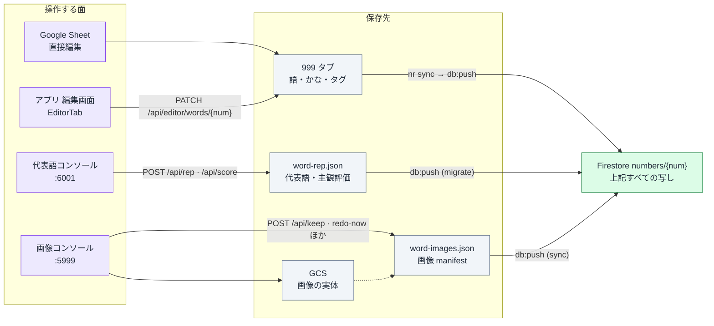
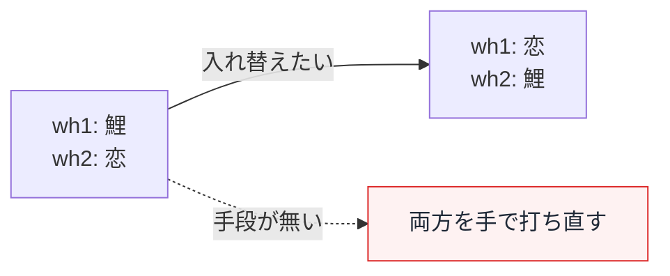

# 1 番号に対する操作の一覧

「051 という番号に対して、いま何ができるか」を実装から洗い出したもの。
操作が **4 つの面に分散**していて、面ごとに保存先が違う。

- Spreadsheet ID: `1F2G4-6lqUPeYzHkpbhUtYKgDzrjNuUo8tbjXKyrzFHM`
- 関連: [データフロー全体像](./data-flow.md) / [Firestore 移行](../.vsdd/firestore-store/README.md)

---

## 0. 全体像



**面ごとに保存先が違うのが現状の本質。** Firestore 移行でこれらは
`numbers/{num}` 1 つに集約されたが、**操作の口はまだ分散したまま**。

---

## 1. 操作の一覧

### 語そのもの (シートが正本)

| 操作                 | 面                | 実体                         | 備考                                      |
| -------------------- | ----------------- | ---------------------------- | ----------------------------------------- |
| 語を追加             | 編集画面          | `addRow`                     | 最大 5 枠 (`MAX_SLOT_COUNT`)              |
| 語を削除             | 編集画面          | `removeRow`                  |                                           |
| 語を変更             | 編集画面 / シート | `PATCH .../words/{num}`      |                                           |
| かなを変更           | 編集画面 / シート | 同上                         | **1〜3 枠目のみ編集可**。4,5 枠目は語だけ |
| 人 / 物 / 概念を変更 | 編集画面 / シート | `hito` / `mono` / `gainen`   | 概念は `mono` に `#g` タグで格納される    |
| タグを付ける         | シート直接        | 語の中に `#tri` `#g` `#i` 等 | 専用 UI は無い                            |

編集画面の保存は `PATCH /api/editor/words/{num}` 1 本。受け付けるキーは
`functions/index.js` の `PATCH_ALIASES` と `SLOT_HEADERS` で決まる。

### 代表語と主観評価 (`word-rep.json` が正本)

| 操作                 | 面               | 実体                             |
| -------------------- | ---------------- | -------------------------------- |
| 代表 ①② を決める     | 代表語コンソール | `POST /api/rep`                  |
| 代表 ①② を入れ替える | 代表語コンソール | `⇅` ボタン / `s` キー            |
| 確定する             | 代表語コンソール | `POST /api/rep` の `confirmed`   |
| 主観評価 -1/0/+1/+2  | 代表語コンソール | `POST /api/score`                |
| 評価を未評価に戻す   | 代表語コンソール | 同じ値をもう一度押す (`v: null`) |

> `⇅` は **代表 ①② の入替**であって、候補スロットの並び替えではない。別物。

### 画像 (`word-images.json` が正本、実体は GCS)

| 操作                     | 面             | 実体                      |
| ------------------------ | -------------- | ------------------------- |
| 自動で探して取得         | 画像コンソール | `POST /api/redo-now`      |
| 検索ワードを指定して取得 | 画像コンソール | `POST /api/search-custom` |
| 確定 / 解除              | 画像コンソール | `POST /api/keep`          |
| 上寄せで再クロップ       | 画像コンソール | `POST /api/recrop`        |
| 2 択で差し替え           | 画像コンソール | `POST /api/set-image`     |
| やり直しフラグ           | 画像コンソール | `POST /api/redo`          |

`#i` タグの枠は DiceBear アバター固定で、**コンソールから操作できない**
(実写に差し替わると困るため)。

### 見る

| 操作                     | 面                                       |
| ------------------------ | ---------------------------------------- |
| 番号一覧 (語・かな)      | アプリ各タブ / 編集画面                  |
| 候補一覧 + rankey + 評価 | 代表語コンソール                         |
| 画像一覧 + 確定状態      | 画像コンソール                           |
| 派生値 (pt / rankey)     | 編集画面 (1 枠目のみ) / 代表語コンソール |

---

## 2. できないこと

実装を確認した限り、次の 3 つは**手段が存在しない**。

### 優先順位の変更 (順序変更)

`wh1 → wh2 → wh3` の並びが優先順位そのものだが、**並び替える UI が無い**。
`moveUp` / `moveDown` / ドラッグのいずれも未実装で、入れ替えるには
両方の語とかなを手で打ち直すしかない。



### 番号の移動

「この語は 051 ではなく 052 だった」という移動手段が無い。
移動元で消して移動先で打ち直すことになり、そのとき
**`rep` / `ratings` / 画像はついてこない**。

### 番号単位の統合ビュー

1 つの番号について「語・かな・rankey・代表・評価・画像・確定状態」を
**まとめて見る画面が無い**。編集画面は語とかな、代表語コンソールは代表と評価、
画像コンソールは画像、と分かれている。

---

## 3. なぜ分散しているか

保存先が 3 つに割れていたため、面もそれに合わせて割れた。

```
シート          → 語・かな・タグ        → アプリ編集画面
word-rep.json   → 代表語・主観評価      → 代表語コンソール
word-images.json → 画像                → 画像コンソール
```

**Firestore 移行でこれは解消した。** `numbers/{num}` が全部持っている。

```json
{
  "num": "051",
  "hito": "...", "mono": "...", "gainen": "...",
  "slots": { "wh1": { "word": "鯉", "kana": "こい", "imageUrl": "..." } },
  "rep": { "picks": [...], "confirmed": true },
  "ratings": [{ "k": "こい", "w": "鯉", "v": 2 }],
  "derived": { "ptBySlot": {...}, "rankeyBySlot": {...} }
}
```

つまり **1 画面で全操作を提供する土台はできている**。
足りないのは操作の口を集約することだけ。

---

## 4. 決まったこと (次にやる 3 つ)

### A. 優先順位の変更を入れる

編集画面に並び替えを足す。`wh1 ⇄ wh2` の入れ替えが 1 操作で済むようにする。
語とかなを打ち直させない。

### B. 語単位の移動を入れる

番号ごと移すのではなく、**特定の語 1 つだけ**を別の番号へ移す。
`051 の wh2「恋」を 052 の wh1 へ` のような操作。

移動時に何が付いてくるかは、保存の形から自然に決まる:

| 付いてくるか     | 理由                                                                                           |
| ---------------- | ---------------------------------------------------------------------------------------------- |
| **かな** ○       | 語と一体。移動先で読みが変わることはない                                                       |
| **画像** ○       | `slots[].imageUrl` が語と同じ入れ物にある                                                      |
| **主観評価** ○   | `ratings` は `{k,w}` の**値**で保存されている。番号ではなく語に紐づく                          |
| **代表 (rep)** △ | 移動元で代表だった場合、移動先でも代表とは限らない。**移動元から外し、移動先では未設定にする** |

評価が付いてくるのは、スロット位置ではなく値で保存している設計の副産物。
「この語呂はアリか」という評価は語の性質なので、番号が変わっても有効。

### C. 番号単位の統合ビューを作る

1 つの番号の全情報を 1 画面に出す。`numbers/{num}` を読むだけで済む。

- 語・かな・rankey・pt (候補ごと)
- 代表 ①② と確定状態
- 主観評価
- 画像と確定状態 (`confirmedFor` とのズレ)

A と B の操作もここに置くのが自然。

---

## 5. 集約するときの注意

`src/firestore/console-writes.js` が既に部分更新の形を持っている。
これを使う限り、片方の更新が他方を壊さない。

- `saveRep` は `ratings` に触れない
- `saveRating` は `rep` と確定状態に触れない
- `confirmImage` は確定時点の語 (`confirmedFor`) を残す

書き込みは必ず `writeNumber` を通す。`intent` で変更するフィールドを宣言し、
宣言していない保護対象 (`rep` / `ratings`) が変われば拒否される。
